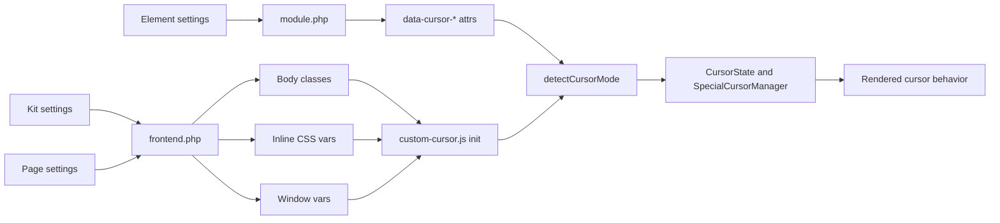
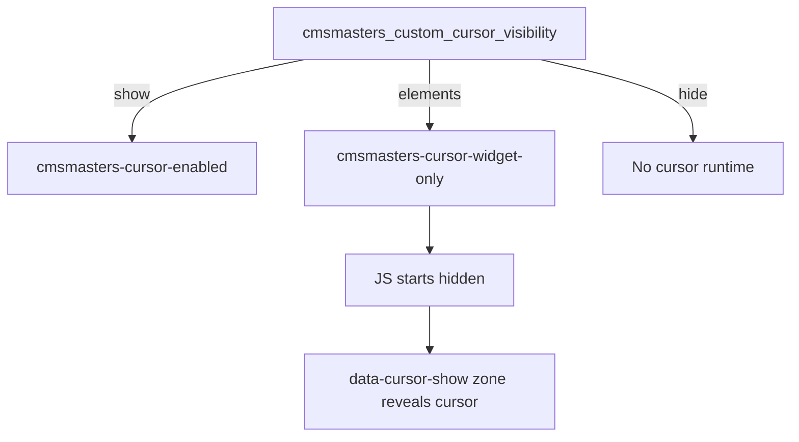
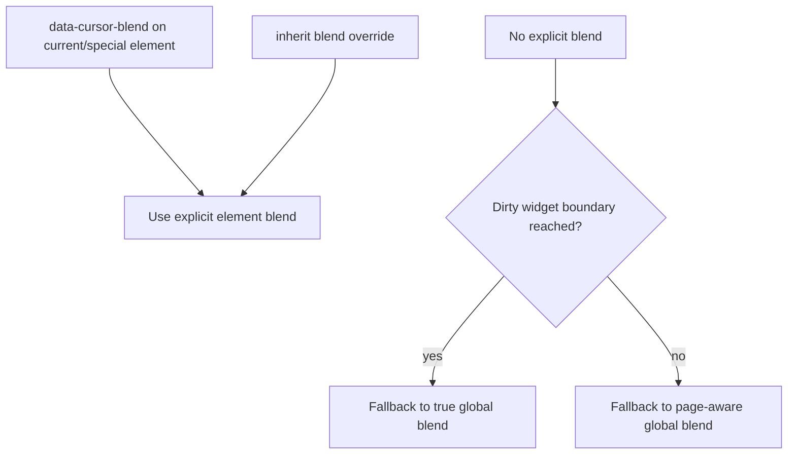

# Functional Map - Codex

**Last Updated:** March 13, 2026

## Summary

This document is a code-verified functional map of the current custom cursor implementation.

It focuses on the actual runtime path in:

- `includes/frontend.php`
- `modules/cursor-controls/module.php`
- `assets/lib/custom-cursor/custom-cursor.js`

Its job is to answer one question clearly:

How does a cursor setting move from Elementor or Kit storage to the final cursor behavior on screen?

This file is intentionally standalone. Older docs may describe legacy names or older architecture.

## Rosetta Stone

There are three active option namespaces in the current codebase.

| Layer | Prefix | Example | Storage |
|---|---|---|---|
| Kit / global | `cmsmasters_custom_cursor_` | `cmsmasters_custom_cursor_visibility` | Kit settings / active kit options |
| Page | `cmsmasters_page_cursor_` | `cmsmasters_page_cursor_blend_mode` | Elementor document settings |
| Element | `cmsmasters_cursor_` | `cmsmasters_cursor_hide` | Element settings in `_elementor_data` |

### Internal mode mapping

Kit visibility is mapped to frontend runtime modes in both PHP layers:

| Kit value | Internal mode | Meaning |
|---|---|---|
| `show` | `yes` | Full custom cursor sitewide |
| `elements` | `widgets` | Widget-only mode |
| `hide` | `''` | Disabled |

### Page over Kit resolution

Most page-aware frontend settings resolve through `get_page_cursor_setting()`:

1. Read `cmsmasters_page_cursor_{key}` from the current document.
2. If empty, fall back to a Kit key under `cmsmasters_custom_cursor_*`.
3. Normalize legacy key and value differences before runtime uses the result.

Current key remaps:

| Requested logical key | Kit suffix read |
|---|---|
| `adaptive` | `adaptive_color` |
| `theme` | `cursor_style` |

Current value remaps:

| Kit suffix | Kit value | Runtime value |
|---|---|---|
| `cursor_style` | `dot_ring` | `classic` |
| `blend_mode` | `disabled` | `''` |

## Runtime Pipeline

The system resolves settings in this order:

### PHP frontend bridge

`includes/frontend.php` controls whether the feature runs and what the JS sees before it starts.

It is responsible for:

- Resolving Kit and page settings
- Adding body classes such as `cmsmasters-cursor-enabled` and `cmsmasters-cursor-widget-only`
- Emitting runtime CSS variables like `--cmsmasters-cursor-color`
- Emitting window flags like `window.cmsmCursorAdaptive`
- Printing the cursor container HTML

### Element render bridge

`modules/cursor-controls/module.php` stamps element wrapper attributes that JS reads at hover time.

It is responsible for:

- Interpreting `cmsmasters_cursor_hide`
- Marking widget-only show zones with `data-cursor-show="yes"`
- Marking full-mode opt-out zones with `data-cursor="hide"`
- Emitting core cursor attributes such as blend, effect, forced color, and hover style
- Emitting special cursor payloads for image, text, and icon modes
- Emitting inherit markers such as `data-cursor-inherit` and related inherit overrides

### JS runtime

`assets/lib/custom-cursor/custom-cursor.js` reads the body classes, window vars, and data attributes and turns them into behavior.

It is responsible for:

- Initialization guards
- `CursorState` body-class state sync
- `SpecialCursorManager` lifecycle for image, text, and icon cursors
- `detectCursorMode()` resolution for hide, special, blend, effect, adaptive mode, and forced color
- RAF rendering of the dot, ring, and special cursor variants

## CSS Variable Split

There are two CSS variable families in play.

| Variable family | Produced by | Example | Used by cursor runtime CSS |
|---|---|---|---|
| `--cmsmasters-custom-cursor-*` | Elementor selector output for Kit controls | `--cmsmasters-custom-cursor-cursor-color` | No |
| `--cmsmasters-cursor-*` | Inline CSS from `enqueue_custom_cursor()` | `--cmsmasters-cursor-color` | Yes |

Important consequence:

- The frontend cursor CSS reads the `--cmsmasters-cursor-*` family.
- Elementor-generated Kit CSS variables exist in parallel but are not the variables consumed by the cursor runtime.

## Key Behaviors

### 1. Sitewide mode

When Kit visibility is `show`, PHP maps that to internal mode `yes`.

Effects:

- Body gets `cmsmasters-cursor-enabled`
- Main JS initializes
- Cursor starts visible
- Global theme, blend, dual mode, wobble, and CSS variables apply immediately

### 2. Widget-only mode

When Kit visibility is `elements`, PHP maps that to internal mode `widgets`.

Effects:

- Body gets `cmsmasters-cursor-widget-only` unless page settings promote it
- JS initializes in widget-only mode
- `CursorState.hidden` is set to `true` at startup
- Cursor only becomes active inside `data-cursor-show` zones

### 3. Page promotion inside widget-only mode

Widget-only mode is not absolute.

If page setting `cmsmasters_page_cursor_disable` is `yes`, `get_document_cursor_state()` treats the page as enabled in widget-only mode and `add_cursor_body_class()` promotes the body class to `cmsmasters-cursor-enabled`.

Meaning:

- Kit says "elements only"
- The page can still opt into full cursor behavior

### 4. Semantic flip of `cmsmasters_cursor_hide`

The same element control changes meaning depending on render mode.

| Context | Toggle value | Render result |
|---|---|---|
| Widget-only show-render mode | `yes` | `data-cursor-show="yes"` is stamped |
| Widget-only show-render mode | not `yes` | No cursor attribute is stamped |
| Full mode | `yes` | Element cursor config is rendered |
| Full mode | not `yes` and element had saved cursor config | `data-cursor="hide"` is stamped |
| Full mode | not `yes` and element had no saved cursor config | Nothing is stamped |

This is the highest-risk semantic trap in the feature.

### 5. Special cursor activation

If element settings contain `cmsmasters_cursor_special_active = yes`, PHP routes into image, text, or icon attribute emitters.

Examples:

- Image mode emits `data-cursor-image`, size, hover size, rotate, hover rotate, effect, and blend
- Text mode emits `data-cursor-text`, typography JSON, color, background, shape data, effect, and blend
- Icon mode emits `data-cursor-icon`, icon styles, size and rotate pairs, shape data, effect, and blend

At runtime, `detectCursorMode()` chooses the closest special cursor candidate, and `SpecialCursorManager.activate()` replaces the normal dot and ring behavior with that special cursor.

### 6. Blend resolution

Blend exists in two different global senses:

- Page-aware global blend from body classes
- True Kit global blend from `window.cmsmCursorTrueGlobalBlend`

JS initializes page-aware blend from body classes, then separately caches true Kit global blend from the window bridge.

Practical rules:

- Explicit element blend wins
- Explicit `default` on special or core cursor resolves to true Kit global blend
- Dirty widgets without explicit blend also fall back to true Kit global blend
- Inner content outside that boundary can still fall back to page-aware global blend

### 7. Adaptive mode

Adaptive mode is enabled through `window.cmsmCursorAdaptive = true`.

At runtime:

- JS samples background colors under the pointer
- It computes luminance
- It uses a short hysteresis window before changing mode
- `CursorState` toggles `cmsmasters-cursor-on-light` or `cmsmasters-cursor-on-dark`

### 8. Effect resolution

Effects resolve differently depending on scope.

- Core cursor effect can come from `data-cursor-effect`
- Page effect is exposed to JS via `window.cmsmCursorEffect` only for non-wobble effects
- Wobble is also represented as a body class
- Special cursors carry their own effect attributes
- Inherit mode can override effect through `data-cursor-inherit-effect`

Important page behavior:

- Page effect `wobble` adds `cmsmasters-cursor-wobble`
- Page effect `none`, `pulse`, `shake`, or `buzz` suppresses global wobble class
- Empty page effect falls back to Kit wobble setting

### 9. Element hide behavior in full mode

In full mode, turning the element toggle off does not always do nothing.

If the element previously had saved cursor configuration, PHP stamps `data-cursor="hide"` so JS can restore the system cursor over that element.

If the element never had cursor configuration, PHP leaves it untouched so global cursor behavior continues.

### 10. Color resolution

Color has a dedicated page-over-Kit resolution path in `get_cursor_color()`.

Order:

1. Page `__globals__` reference for `cmsmasters_page_cursor_color`
2. Direct page hex value
3. Kit `__globals__` reference for `cmsmasters_custom_cursor_cursor_color`
4. Direct Kit hex value

Resolved color is emitted as:

- `--cmsmasters-cursor-color`
- `--cmsmasters-cursor-color-dark`

Per-element forced color can still override this later through `data-cursor-color`.

## Runtime Reference Tables

### Window vars bridge

| Window var | PHP source | Meaning |
|---|---|---|
| `window.cmsmCursorAdaptive` | Page > Kit adaptive | Enable luminance detection |
| `window.cmsmCursorTheme` | Page > Kit theme | Non-classic cursor theme |
| `window.cmsmCursorSmooth` | Page > Kit smoothness | Lerp profile |
| `window.cmsmCursorEffect` | Page effect when non-empty and non-wobble | Global non-wobble fallback effect |
| `window.cmsmCursorTrueGlobalBlend` | Kit blend only | Widget fallback "default/global" blend |
| `window.cmsmCursorWidgetOnly` | Widget-only mode flag | Start hidden unless show zone |

### Body classes

| Class | Source | Meaning |
|---|---|---|
| `cmsmasters-cursor-enabled` | PHP | Full cursor mode active |
| `cmsmasters-cursor-widget-only` | PHP | Widget-only mode active |
| `cmsmasters-cursor-theme-{theme}` | PHP and JS | Theme selection |
| `cmsmasters-cursor-dual` | PHP | System cursor remains visible |
| `cmsmasters-cursor-blend` | PHP or `CursorState` | Blend enabled |
| `cmsmasters-cursor-blend-{soft|medium|strong}` | PHP or `CursorState` | Blend intensity |
| `cmsmasters-cursor-wobble` | PHP | Wobble enabled globally |
| `cmsmasters-cursor-hover` | `CursorState` | Hovering cursor-aware target |
| `cmsmasters-cursor-down` | `CursorState` | Pointer down |
| `cmsmasters-cursor-hidden` | `CursorState` | Cursor hidden |
| `cmsmasters-cursor-text` | `CursorState` | Text hover state |
| `cmsmasters-cursor-on-light` | `CursorState` | Adaptive mode over light background |
| `cmsmasters-cursor-on-dark` | `CursorState` | Adaptive mode over dark background |
| `cmsmasters-cursor-size-{sm|md|lg}` | `CursorState` | Size variant |

### Data attributes that affect runtime

| Attribute | Source | Purpose |
|---|---|---|
| `data-cursor-show` | Widget-only render bridge | Reveal zone |
| `data-cursor="hide"` | Full-mode render bridge | Suppress custom cursor on element |
| `data-cursor` | Core element bridge | Core hover style |
| `data-cursor-color` | Core element bridge | Forced color override |
| `data-cursor-blend` | Core or special bridge | Blend override |
| `data-cursor-effect` | Core bridge | Core effect override |
| `data-cursor-image` | Special image bridge | Image cursor activation |
| `data-cursor-text` | Special text bridge | Text cursor activation |
| `data-cursor-icon` | Special icon bridge | Icon cursor activation |
| `data-cursor-inherit` | Inherit bridge | Transparent cursor boundary with override support |
| `data-cursor-inherit-blend` | Inherit bridge | Blend inheritance override |
| `data-cursor-inherit-effect` | Inherit bridge | Effect inheritance override |

## Known Semantic Traps

### `cmsmasters_cursor_hide` is not a simple "hide" flag

In widget-only render mode, `yes` means "this element is a show zone."

In full mode, turning it off can still stamp `data-cursor="hide"` if the element had saved cursor config.

### Page blend does not fully cascade through dirty widgets

When JS hits a widget boundary that has cursor settings, unset blend behavior falls back to true Kit global blend, not the page override.

### `default` blend means Kit-global default, not page default

For special cursor zones and core cursor zones, `default` resolves to `window.cmsmCursorTrueGlobalBlend`.

### PHP-rendered blend classes must sync into `CursorState`

JS initializes `CursorState._state.blend` from existing body classes. Without that sync, switching blend off at runtime would leave stale body classes behind.

## Source Pointers

Use these code entry points when re-verifying this map:

- `includes/frontend.php`
  - `get_document_cursor_state()`
  - `get_page_cursor_setting()`
  - `get_cursor_mode()`
  - `enqueue_custom_cursor()`
  - `add_cursor_body_class()`
  - `get_cursor_color()`
- `modules/cursor-controls/module.php`
  - `apply_cursor_attributes()`
  - `apply_image_cursor_attributes()`
  - `apply_text_cursor_attributes()`
  - `apply_icon_cursor_attributes()`
  - `apply_core_cursor_attributes()`
- `assets/lib/custom-cursor/custom-cursor.js`
  - `CursorState`
  - `SpecialCursorManager`
  - `detectCursorMode()`

## Verification Notes

This document is based on the current code path, not the older naming shown in legacy docs.

Any future change to:

- option prefixes
- body class names
- window bridge variables
- data attribute names
- blend fallback logic
- widget-only promotion behavior

should be treated as a reason to re-verify this map.
