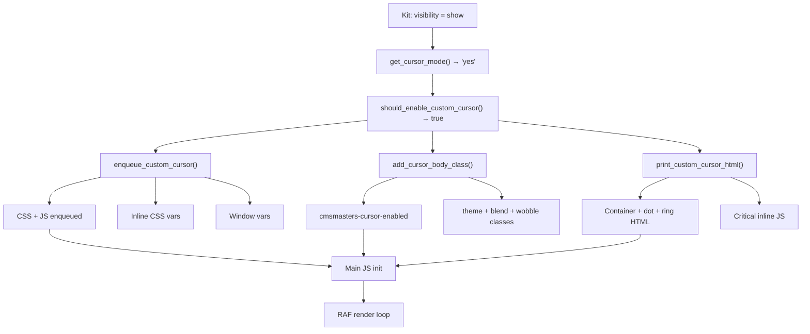
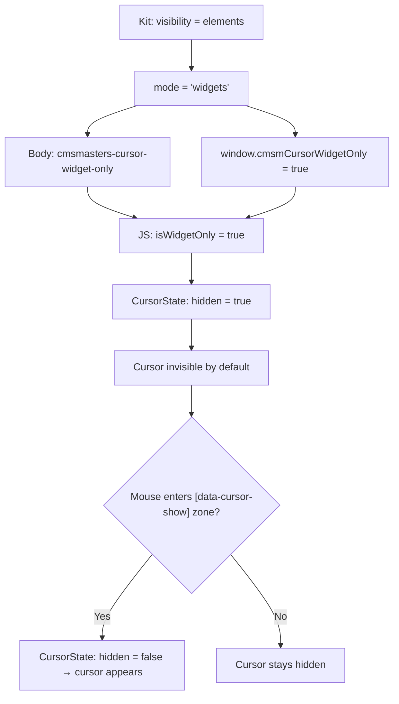
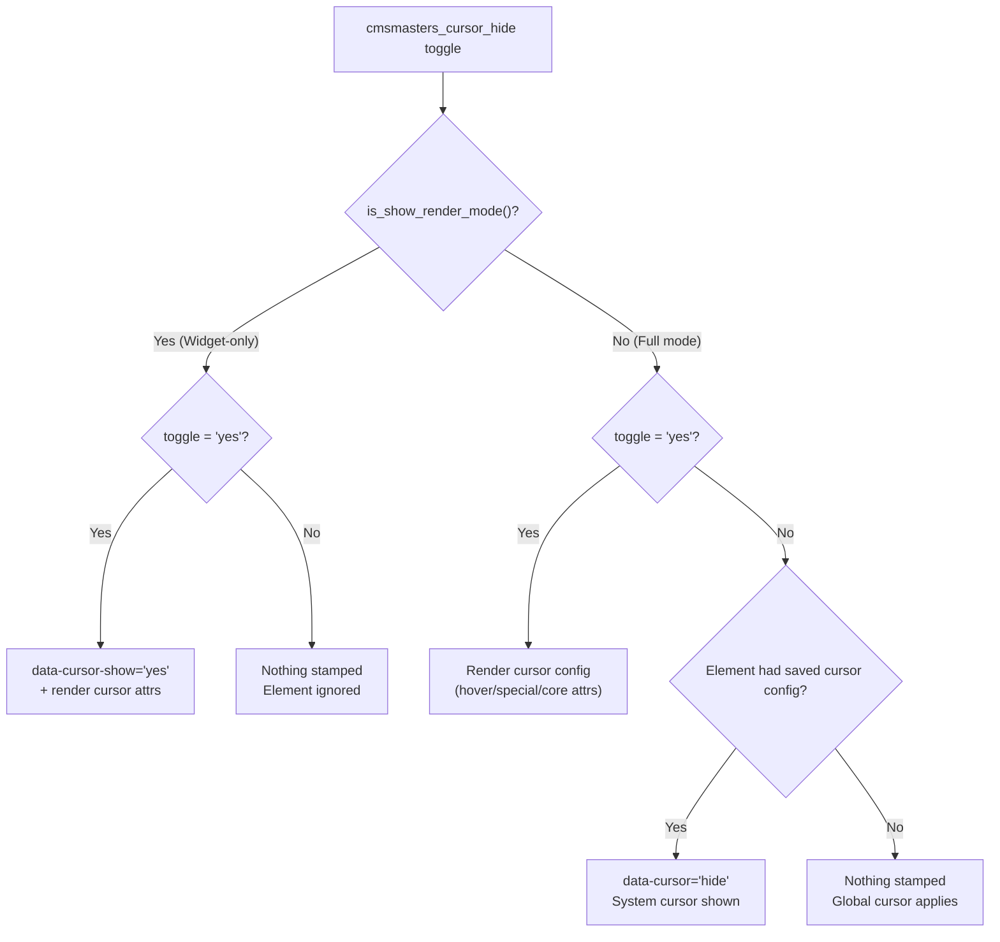
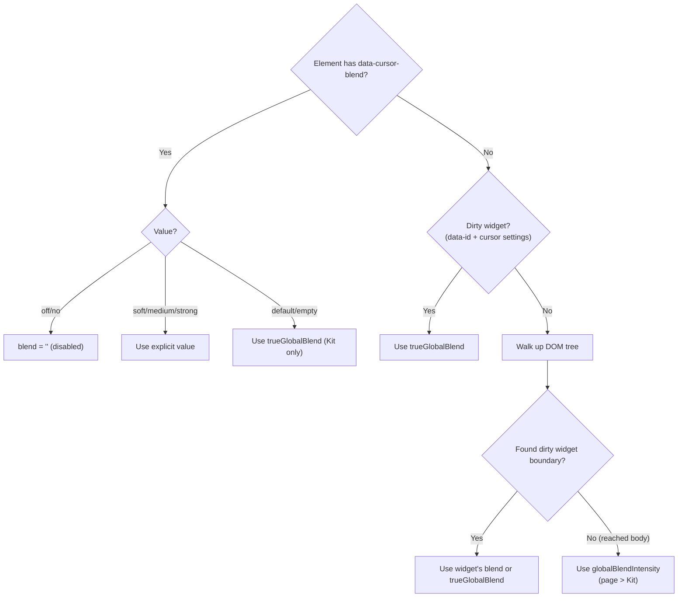
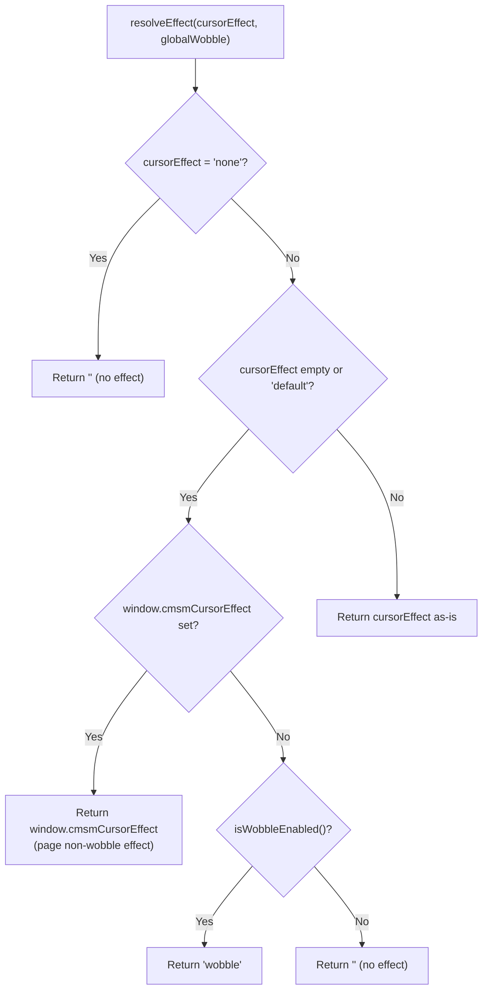
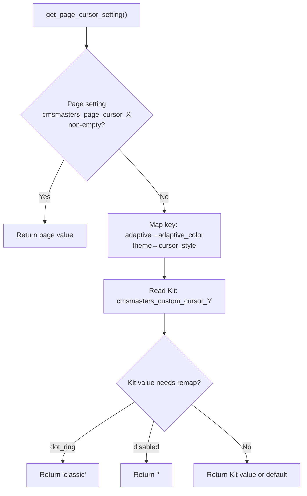
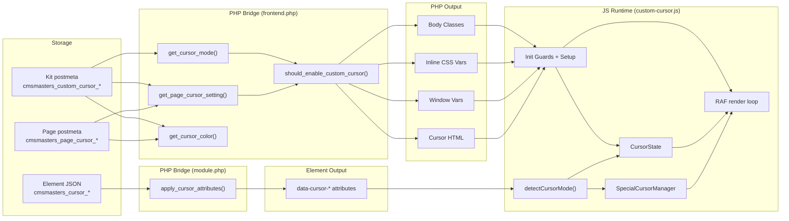

# Functional Map — Source of Truth

**Version:** 5.7 | **Last Verified:** March 13, 2026
**Scope:** Every cursor feature end-to-end, from UI control to visual result.

> This document supersedes scattered references in other docs. When in doubt, this is the canonical map.
> Cross-reference: `FUNCTIONAL-MAP-CODEX.md` for the concise narrative version.

---

## Preamble: Settings Rosetta Stone

### Three Option Namespaces

| Layer | Prefix | Storage | Override Priority |
|---|---|---|---|
| **Kit (Global)** | `cmsmasters_custom_cursor_` | Elementor Kit postmeta `_elementor_page_settings` | Lowest |
| **Page** | `cmsmasters_page_cursor_` | Elementor document postmeta per page/post | Middle |
| **Element** | `cmsmasters_cursor_` | Element `_elementor_data` JSON | Highest |

### Complete Settings Cross-Reference

| Feature | Kit Control Suffix | Page Control | Element Control | Window Var | Body Class | CSS Var | Data Attribute |
|---|---|---|---|---|---|---|---|
| **Visibility/Mode** | `visibility` | `disable` (toggle) | `hide` (toggle) | `cmsmCursorWidgetOnly` | `cmsmasters-cursor-enabled` / `cmsmasters-cursor-widget-only` | — | `data-cursor-show` / `data-cursor="hide"` |
| **Cursor Theme** | `cursor_style` | `theme` | — | `cmsmCursorTheme` | `cmsmasters-cursor-theme-{name}` | — | — |
| **System Cursor** | `show_system_cursor` | — | — | — | `cmsmasters-cursor-dual` | — | — |
| **Cursor Color** | `cursor_color` | `color` | `color` (+ `force_color`) | — | — | `--cmsmasters-cursor-color`, `--cmsmasters-cursor-color-dark` | `data-cursor-color` |
| **Adaptive Color** | `adaptive_color` | `adaptive` | — | `cmsmCursorAdaptive` | `cmsmasters-cursor-on-light` / `cmsmasters-cursor-on-dark` | — | — |
| **Blend Mode** | `blend_mode` | `blend_mode` | `blend_mode` (core) / `special_blend` (special) | `cmsmCursorTrueGlobalBlend` | `cmsmasters-cursor-blend` + `cmsmasters-cursor-blend-{intensity}` | — | `data-cursor-blend` |
| **Cursor Size** | `cursor_size` | — | — | — | — | `--cmsmasters-cursor-dot-size` | — |
| **Hover Size** | `size_on_hover` | — | — | — | — | `--cmsmasters-cursor-dot-hover-size` | — |
| **Smoothness** | `smoothness` | `smoothness` | — | `cmsmCursorSmooth` | — | — | — |
| **Wobble/Effect** | `wobble_effect` | `effect` | `effect` | `cmsmCursorEffect` (non-wobble) | `cmsmasters-cursor-wobble` | — | `data-cursor-effect` |
| **Editor Preview** | `editor_preview` | — | — | — | — | — | — |
| **Hover Style** | — | — | `hover_style` | — | `cmsmasters-cursor-hover` | — | `data-cursor` (value: `hover`) |
| **Special Cursor** | — | — | `special_active` + `special_type` | — | — | — | `data-cursor-image` / `data-cursor-text` / `data-cursor-icon` |
| **Inherit Parent** | — | — | `inherit_parent` | — | — | — | `data-cursor-inherit` + `data-cursor-inherit-blend` + `data-cursor-inherit-effect` |

### Value Mappings (Code-Verified)

**Kit Visibility → Internal Mode** (`frontend.php:1349`, `module.php:1394`):

| Kit `visibility` | Internal `mode` | Meaning |
|---|---|---|
| `show` | `yes` | Full custom cursor sitewide |
| `elements` | `widgets` | Widget-only — cursor hidden by default |
| `hide` | `''` | Disabled — no cursor runtime loaded |

**Kit Key → Kit Suffix Remap** (`frontend.php:1316-1320`):

| Logical Key | Kit Suffix Read |
|---|---|
| `adaptive` | `adaptive_color` |
| `theme` | `cursor_style` |

**Kit Value → Internal Value Remap** (`frontend.php:1325-1331`):

| Kit Suffix | Kit Value | Runtime Value |
|---|---|---|
| `cursor_style` | `dot_ring` | `classic` |
| `blend_mode` | `disabled` | `''` |

**Blend Legacy** (`frontend.php:1595-1596`, `frontend.php:1532-1533`):

| Stored Value | Normalized Value |
|---|---|
| `yes` | `medium` |

### Dual CSS Variable Output

| Variable Family | Produced By | Example | Used by Cursor CSS? |
|---|---|---|---|
| `--cmsmasters-custom-cursor-*` | Elementor Kit selector output | `--cmsmasters-custom-cursor-cursor-color` | **No** (dead weight) |
| `--cmsmasters-cursor-*` | `enqueue_custom_cursor()` inline CSS | `--cmsmasters-cursor-color` | **Yes** |

The Kit CSS variables exist because Elementor auto-generates them for all Kit controls with selectors. They are never consumed. Our inline CSS writes the variables that `custom-cursor.css` actually reads.

---

## Part 1: Scenarios

### Scenario 1: Enable "Show Sitewide"

**What the user does:** Sets Kit → Custom Cursor → Visibility to "Show Sitewide"

**Chain:**
1. Kit stores `cmsmasters_custom_cursor_visibility` = `show`
2. `get_cursor_mode()` (frontend.php:1345) maps `show` → `yes`
3. `should_enable_custom_cursor()` (frontend.php:1378) returns true
4. `enqueue_custom_cursor()` (frontend.php:1449) loads CSS + JS + inline vars
5. `add_cursor_body_class()` (frontend.php:1557) adds `cmsmasters-cursor-enabled`
6. Also adds: theme class, dual class, blend classes, wobble class
7. `print_custom_cursor_html()` (frontend.php:1629) outputs container + dot + ring HTML
8. Also outputs `print_cursor_critical_js()` — lightweight inline script for instant response
9. Main JS loads → singleton guard (line 155) → checks `body.classList.contains('cmsmasters-cursor-enabled')` (line 550)
10. Init: CursorState, blend sync, smoothness, adaptive, theme
11. RAF loop starts → cursor follows mouse

**What can break:**
- Missing body class = JS won't init
- Body class added but HTML not printed = JS inits but no elements to animate
- Critical JS loaded but main JS fails = cursor stuck in basic follow mode



---

### Scenario 2: Enable "Show on Individual Elements"

**What the user does:** Sets Kit → Visibility to "Show on Individual Elements"

**Chain:**
1. Kit stores `cmsmasters_custom_cursor_visibility` = `elements`
2. `get_cursor_mode()` maps `elements` → `widgets`
3. `should_enable_custom_cursor()` returns true (widgets mode keeps runtime available)
4. `add_cursor_body_class()` adds `cmsmasters-cursor-widget-only` (unless page promotes — see Scenario 3)
5. `print_custom_cursor_html()` outputs container but **skips** critical JS (cursor starts hidden)
6. `enqueue_custom_cursor()` sets `window.cmsmCursorWidgetOnly = true` (frontend.php:1541)
7. JS checks `body.classList.contains('cmsmasters-cursor-widget-only')` → `isWidgetOnly = true` (line 549)
8. `CursorState.transition({ hidden: true })` on init (line 604) — cursor invisible
9. Only `[data-cursor-show]` zones trigger cursor visibility via `detectCursorMode()`

**What can break:**
- Page promotion changes body class unexpectedly
- Element without `data-cursor-show` = cursor stays hidden
- Missing `cmsmCursorWidgetOnly` window var = JS doesn't know it's widget-only (but body class is backup)



---

### Scenario 3: Toggle Semantic Flip

**What the user does:** Toggles `cmsmasters_cursor_hide` on an element

**The same control has DIFFERENT semantics in each mode:**

| Mode | Toggle = `yes` | Toggle = `''` (off) |
|---|---|---|
| **Widget-only** (show render) | `data-cursor-show="yes"` stamped → this is a reveal zone | Nothing stamped → element ignored |
| **Full** (normal render) | Cursor config rendered (hover, special, core attrs) | If element had saved config → `data-cursor="hide"`; if never configured → nothing stamped |

**Code paths** (module.php:1409-1442):
- `is_show_render_mode()` determines which branch
- Full mode "hide" detection: checks `$element->get_data()['settings']` for `cmsmasters_cursor_hover_style`, `cmsmasters_cursor_special_active`, or `cmsmasters_cursor_inherit_parent` (lines 1429-1432)



---

### Scenario 4: Activate Special Cursor on Widget

**What the user does:** Enable toggle → Special Cursor = Yes → Type = Image → uploads image

**Chain:**
1. Element stores: `cmsmasters_cursor_hide` = `yes`, `cmsmasters_cursor_special_active` = `yes`, `cmsmasters_cursor_special_type` = `image`
2. `apply_cursor_attributes()` (module.php:1409) → dispatches to `apply_image_cursor_attributes()` (module.php:1497)
3. PHP stamps: `data-cursor-image="URL"`, `data-cursor-image-size`, `data-cursor-image-size-hover`, `data-cursor-image-rotate`, `data-cursor-image-rotate-hover`, optionally `data-cursor-image-effect`, `data-cursor-blend`
4. JS `detectCursorMode()` (line 1809): `findWithBoundary(el, 'data-cursor-image', null)`
5. Closest special wins if multiple types nested (depth comparison, line 1829-1841)
6. Core cursor settings checked — if closer core exists, it wins over farther special (line 1843-1864)
7. `SpecialCursorManager.activate('image', ...)` creates/updates image cursor element
8. Dot + ring hidden (`isRingHidden = true`, visibility hidden)
9. Image cursor follows mouse with spring physics for size/rotate transitions

**Data attributes for each special type:**

| Type | Primary Attr | Size | Size Hover | Rotate | Rotate Hover | Effect | Blend |
|---|---|---|---|---|---|---|---|
| Image | `data-cursor-image` | `data-cursor-image-size` | `data-cursor-image-size-hover` | `data-cursor-image-rotate` | `data-cursor-image-rotate-hover` | `data-cursor-image-effect` | `data-cursor-blend` |
| Text | `data-cursor-text` | — | — | — | — | `data-cursor-text-effect` | `data-cursor-blend` |
| Icon | `data-cursor-icon` | `data-cursor-icon-size` | `data-cursor-icon-size-hover` | `data-cursor-icon-rotate` | `data-cursor-icon-rotate-hover` | `data-cursor-icon-effect` | `data-cursor-blend` |

---

### Scenario 5: Enable Blend Mode Globally

**What the user does:** Sets Kit → Blend Mode to "Soft"

**Chain:**
1. Kit stores `cmsmasters_custom_cursor_blend_mode` = `soft`
2. `get_page_cursor_setting('blend_mode', 'blend_mode', 'disabled')` (frontend.php:1592) — page empty → falls back to Kit → `soft`
3. `add_cursor_body_class()` adds `cmsmasters-cursor-blend` + `cmsmasters-cursor-blend-soft` (lines 1599-1601)
4. JS reads body classes → `globalBlendIntensity = 'soft'` (lines 692-698)
5. Sync: `CursorState._state.blend = globalBlendIntensity` (lines 705-706) — prevents no-op transition bug
6. `cmsmCursorTrueGlobalBlend` (frontend.php:1536): Kit-only blend, NOT page > global
7. JS: `trueGlobalBlend = window.cmsmCursorTrueGlobalBlend || ''` (line 711)

**Two "global" blend values exist simultaneously:**

| Variable | Source | Contains | Used For |
|---|---|---|---|
| `globalBlendIntensity` | Body classes (page > Kit) | Page override or Kit fallback | Body-level fallback when no widget boundary |
| `trueGlobalBlend` | Window var (Kit only) | Kit-only value | Widget "Default" fallback, dirty widget boundary fallback |

---

### Scenario 6: Blend Resolution for Widgets

**What the user does:** Widget A has blend = "Default", nested inside Section B with blend = "Strong"

**Resolution logic** (JS lines 2117-2187):

```
1. Element has explicit data-cursor-blend?
   → "off"/"no" → blend = ''
   → "soft"/"medium"/"strong" → use that value
   → "yes" → use trueGlobalBlend || 'soft'
   → "default"/"" → use trueGlobalBlend (Kit only, NOT page)

2. Element has NO blend attribute?
   → Is it a dirty widget (data-id + has cursor settings)?
     → Yes → use trueGlobalBlend
   → Is it inner content (no data-id)?
     → Walk up to find blend:
       → Hit dirty widget boundary → STOP → use its blend or trueGlobalBlend
       → Hit clean element with blend → use that blend
       → Hit body → use globalBlendIntensity (page > Kit)
```



---

### Scenario 7: Enable Adaptive Color

**What the user does:** Kit → Adaptive Color = "Enabled" (or page override)

**Chain:**
1. `get_page_cursor_setting('adaptive', 'adaptive', 'yes')` — maps key `adaptive` → Kit suffix `adaptive_color` (frontend.php:1317)
2. If `yes`: `window.cmsmCursorAdaptive = true` (frontend.php:1504)
3. JS: `adaptive = window.cmsmCursorAdaptive || false` (line 626)
4. In `detectCursorMode()` (lines 2214+): walk up DOM checking `getComputedStyle().backgroundColor`
5. Compute relative luminance → compare to threshold
6. Hysteresis: `pendingMode` must match for 3 consecutive frames before change
7. Sticky mode: `lastModeChangeTime` + `STICKY_MODE_DURATION` (500ms) prevents rapid flip-flop
8. `CursorState.transition({ mode: 'on-light' })` or `{ mode: 'on-dark' }`
9. Body class `cmsmasters-cursor-on-light` or `cmsmasters-cursor-on-dark` toggles CSS color vars

**What can break:**
- Semi-transparent overlays confuse luminance (popup fix: skip `.elementor-popup-modal`)
- Widget-only: adaptive skipped outside show zones (line 1695-1697)
- Sticky mode too aggressive → delayed color change at sharp boundary

---

### Scenario 8: Apply Effect

**What the user does:** Various combinations of Kit wobble, page effect, element effect

**Effect resolution: `resolveEffect(cursorEffect, globalWobble)`** (JS line 983-992):

```javascript
if (cursorEffect === 'none') return '';                        // Explicit none
if (!cursorEffect || cursorEffect === 'default') {            // Empty or default
    if (window.cmsmCursorEffect) return window.cmsmCursorEffect; // Page non-wobble effect
    return globalWobble ? 'wobble' : '';                       // Kit wobble or none
}
return cursorEffect;                                           // Explicit effect name
```

**PHP wobble class logic** (frontend.php:1604-1619):

| Page Effect Value | Body Class Result |
|---|---|
| `wobble` | `cmsmasters-cursor-wobble` added |
| `none`, `pulse`, `shake`, `buzz` | Wobble class **suppressed** (even if Kit wobble = yes) |
| `''` (empty/inherit) | Fall back to Kit: `cmsmasters_custom_cursor_wobble_effect` → if `yes` add wobble class |

**PHP window var** (frontend.php:1521-1523): `window.cmsmCursorEffect` is set ONLY when page effect is non-empty, non-`none`, AND non-`wobble`. Wobble is handled via body class instead.



---

### Scenario 9: Hide Cursor on Element (Full Mode)

**What the user does:** Element had cursor configured → user turns toggle off

**Chain:**
1. `apply_cursor_attributes()` → full mode branch (module.php:1422-1438)
2. `toggle !== 'yes'` → check if element had saved config
3. `$saved = $element->get_data()['settings']` — reads raw `_elementor_data` JSON
4. `has_config` check: `cmsmasters_cursor_hover_style` OR `cmsmasters_cursor_special_active=yes` OR `cmsmasters_cursor_inherit_parent=yes`
5. If `has_config` true → `data-cursor="hide"` stamped
6. JS `detectCursorMode()` line 1700: `var hideEl = el.closest('[data-cursor="hide"],[data-cursor="none"]')`
7. If found → `return` — skips ALL detection (color, blend, effect, adaptive)
8. System cursor shown on that element

**If element was NEVER configured:** nothing stamped → global cursor applies normally.

---

### Scenario 10: Page-Level Override Waterfall

**What the user does:** Sets page-level cursor theme, blend, effect, color overrides

**`get_page_cursor_setting($page_key, $global_key, $default)`** (frontend.php:1301-1334):

```
1. Read page setting: cmsmasters_page_cursor_{$page_key}
   → Non-empty? Return it.

2. Map global key to Kit suffix (adaptive→adaptive_color, theme→cursor_style)

3. Read Kit setting: cmsmasters_custom_cursor_{$kit_suffix}

4. Map Kit values to internal (dot_ring→classic, disabled→'')

5. Return Kit value or $default
```

**Color resolution is special** — `get_cursor_color()` (frontend.php:1742-1799):
1. Page `__globals__` reference → resolve via Kit system/custom colors
2. Page direct hex value
3. Kit `__globals__` reference → resolve
4. Kit direct hex value
5. Empty string (use CSS default)



---

## Part 2: Technical Detail Matrices

### Matrix A: Complete Settings Resolution

#### Kit Controls (11 controls, registered in Kit → Theme Settings → Custom Cursor)

| # | Kit Suffix | Type | Default | Values | frontend.php Usage |
|---|---|---|---|---|---|
| 1 | `visibility` | SELECT | `elements` | `show` / `elements` / `hide` | `get_cursor_mode()` :1346 |
| 2 | `cursor_style` | SELECT | `dot_ring` | `dot_ring` / `dot` | `get_page_cursor_setting('theme','theme')` :1508 |
| 3 | `show_system_cursor` | SWITCHER | `yes` | `yes` / `''` | `add_cursor_body_class()` :1586 |
| 4 | `cursor_color` | COLOR | `''` | hex | `get_cursor_color()` :1790 |
| 5 | `adaptive_color` | SELECT | `yes` | `yes` / `no` | `get_page_cursor_setting('adaptive','adaptive')` :1502 |
| 6 | `blend_mode` | SELECT | `disabled` | `disabled` / `soft` / `medium` / `strong` | `get_page_cursor_setting('blend_mode','blend_mode')` :1592, `enqueue_custom_cursor()` :1528 |
| 7 | `cursor_size` | SLIDER | `8` | 4-20 px | `enqueue_custom_cursor()` :1471 |
| 8 | `size_on_hover` | SLIDER | `40` | 20-80 px | `enqueue_custom_cursor()` :1472 |
| 9 | `smoothness` | SELECT | `smooth` | `precise` / `snappy` / `normal` / `smooth` / `fluid` | `get_page_cursor_setting('smoothness','smoothness')` :1515 |
| 10 | `wobble_effect` | SWITCHER | `yes` | `yes` / `''` | `add_cursor_body_class()` :1615 |
| 11 | `editor_preview` | SWITCHER | `''` | `yes` / `''` | `should_enable_custom_cursor()` :1401 |

#### Page Controls (8 controls, registered in Page Settings → Advanced → Custom Cursor)

| # | Page Control ID | Type | Default | Values | Condition |
|---|---|---|---|---|---|
| 1 | `cmsmasters_page_cursor_disable` | SWITCHER | `''` | `yes` / `''` | Always visible (label flips per mode) |
| 2 | `cmsmasters_page_cursor_theme` | SELECT | `''` | `''` / `classic` / `dot` | Toggle-dependent |
| 3 | `cmsmasters_page_cursor_smoothness` | SELECT | `''` | `''` / `precise` / `snappy` / `normal` / `smooth` / `fluid` | Toggle-dependent |
| 4 | `cmsmasters_page_cursor_blend_mode` | SELECT | `''` | `''` / `off` / `soft` / `medium` / `strong` | Toggle-dependent |
| 5 | `cmsmasters_page_cursor_effect` | SELECT | `''` | `''` / `none` / `wobble` / `pulse` / `shake` / `buzz` | Toggle-dependent |
| 6 | `cmsmasters_page_cursor_adaptive` | SELECT | `''` | `''` / `yes` / `no` | Toggle-dependent |
| 7 | `cmsmasters_page_cursor_color` | COLOR | `''` | hex / global ref | Toggle-dependent |
| 8 | `cmsmasters_page_cursor_reset` | RAW_HTML | — | Button | Toggle-dependent |

**Page toggle semantics:**
- Widget-only mode: controls visible when `cmsmasters_page_cursor_disable` = `yes` (opt-in)
- Full mode: controls visible when `cmsmasters_page_cursor_disable` = `''` (opt-out)

#### Element Controls (key controls, registered on widgets/sections/containers → Advanced → Custom Cursor)

| # | Element Control ID | Type | Default | Role |
|---|---|---|---|---|
| 1 | `cmsmasters_cursor_hide` | SWITCHER | `''` | Master toggle (semantic flip per mode) |
| 2 | `cmsmasters_cursor_inherit_parent` | SWITCHER | `''` | Transparent cursor boundary |
| 3 | `cmsmasters_cursor_inherit_blend` | SELECT | `''` | Blend override in inherit mode |
| 4 | `cmsmasters_cursor_inherit_effect` | SELECT | `''` | Effect override in inherit mode |
| 5 | `cmsmasters_cursor_special_active` | SWITCHER | `''` | Enable special cursor |
| 6 | `cmsmasters_cursor_special_type` | SELECT | `image` | `image` / `text` / `icon` |
| 7 | `cmsmasters_cursor_hover_style` | SELECT | `''` | Core hover style (`''` / `hover`) |
| 8 | `cmsmasters_cursor_force_color` | SWITCHER | `''` | Enable per-element color |
| 9 | `cmsmasters_cursor_color` | COLOR | `''` | Per-element color value |
| 10 | `cmsmasters_cursor_blend_mode` | SELECT | `''` | Core blend mode |
| 11 | `cmsmasters_cursor_special_blend` | CHOOSE_TEXT | `off` | Special blend mode |
| 12 | `cmsmasters_cursor_effect` | SELECT | `''` | Animation effect |

---

### Matrix B: Data Attribute Catalog

| Attribute | Set By (PHP) | Line# | Read By (JS) | Allowed Values | Inheritance |
|---|---|---|---|---|---|
| `data-cursor-show` | `apply_cursor_attributes()` | module.php:1421 | `detectCursorMode()` via `SHOW_ZONE_SELECTOR` | `yes` | Direct on element |
| `data-cursor` | `apply_core_cursor_attributes()` / hide logic | module.php:1688 / 1435 | `detectCursorMode()` via `findWithBoundary` | `hover` / `hide` / `none` | Cascades up via `findWithBoundary` |
| `data-cursor-color` | `apply_core_cursor_attributes()` | module.php:1697 | `updateForcedColor()` via `.closest()` | hex color string | Cascades up via `.closest()` |
| `data-cursor-blend` | `apply_core_cursor_attributes()` / special blend | module.php:1704 / 1526,1789 | Blend resolution in `detectCursorMode()` | `''` / `off` / `no` / `soft` / `medium` / `strong` / `default` / `yes` | Cascades up with widget boundary |
| `data-cursor-effect` | `apply_core_cursor_attributes()` / `apply_effect_and_blend()` | module.php:1710 / 1784 | `findWithBoundary(el, 'data-cursor-effect')` | `''` / `none` / `wobble` / `pulse` / `shake` / `buzz` | Cascades up via `findWithBoundary` |
| `data-cursor-image` | `apply_image_cursor_attributes()` | module.php:1503 | `findWithBoundary(el, 'data-cursor-image')` | URL string | Cascades up via `findWithBoundary` |
| `data-cursor-image-size` | `apply_image_cursor_attributes()` | module.php:1512 | `SpecialCursorManager` | number (px) | Direct on element |
| `data-cursor-image-size-hover` | `apply_image_cursor_attributes()` | module.php:1513 | `SpecialCursorManager` | number (px) | Direct on element |
| `data-cursor-image-rotate` | `apply_image_cursor_attributes()` | module.php:1514 | `SpecialCursorManager` | number (deg) | Direct on element |
| `data-cursor-image-rotate-hover` | `apply_image_cursor_attributes()` | module.php:1515 | `SpecialCursorManager` | number (deg) | Direct on element |
| `data-cursor-image-effect` | `apply_image_cursor_attributes()` | module.php:1520 | `SpecialCursorManager` | effect name | Direct on element |
| `data-cursor-text` | `apply_text_cursor_attributes()` | module.php:1543 | `findWithBoundary(el, 'data-cursor-text')` | text string | Cascades up via `findWithBoundary` |
| `data-cursor-text-typography` | `apply_text_cursor_attributes()` | module.php:1567 | `SpecialCursorManager` | JSON object | Direct on element |
| `data-cursor-text-color` | `apply_text_cursor_attributes()` | module.php:1572 | `SpecialCursorManager` | hex color | Direct on element |
| `data-cursor-text-bg` | `apply_text_cursor_attributes()` | module.php:1577 | `SpecialCursorManager` | hex color | Direct on element |
| `data-cursor-text-circle` | `apply_text_cursor_attributes()` | module.php:1583 | `SpecialCursorManager` | `yes` | Direct on element |
| `data-cursor-text-circle-spacing` | `apply_text_cursor_attributes()` | module.php:1584 | `SpecialCursorManager` | number (px) | Direct on element |
| `data-cursor-text-radius` | `apply_shape_attributes()` | module.php:1757 | `SpecialCursorManager` | CSS border-radius | Direct on element |
| `data-cursor-text-padding` | `apply_shape_attributes()` | module.php:1770 | `SpecialCursorManager` | CSS padding | Direct on element |
| `data-cursor-text-effect` | `apply_effect_and_blend()` | module.php:1784 | `SpecialCursorManager` | effect name | Direct on element |
| `data-cursor-icon` | `apply_icon_cursor_attributes()` | module.php:1641 | `findWithBoundary(el, 'data-cursor-icon')` | HTML string (sanitized) | Cascades up via `findWithBoundary` |
| `data-cursor-icon-color` | `apply_icon_cursor_attributes()` | module.php:1650 | `SpecialCursorManager` | hex color | Direct on element |
| `data-cursor-icon-bg` | `apply_icon_cursor_attributes()` | module.php:1654 | `SpecialCursorManager` | hex color | Direct on element |
| `data-cursor-icon-preserve` | `apply_icon_cursor_attributes()` | module.php:1647 | `SpecialCursorManager` | `yes` | Direct on element |
| `data-cursor-icon-size` | `apply_icon_cursor_attributes()` | module.php:1659 | `SpecialCursorManager` | number (px) | Direct on element |
| `data-cursor-icon-size-hover` | `apply_icon_cursor_attributes()` | module.php:1662 | `SpecialCursorManager` | number (px) | Direct on element |
| `data-cursor-icon-rotate` | `apply_icon_cursor_attributes()` | module.php:1660 | `SpecialCursorManager` | number (deg) | Direct on element |
| `data-cursor-icon-rotate-hover` | `apply_icon_cursor_attributes()` | module.php:1662 | `SpecialCursorManager` | number (deg) | Direct on element |
| `data-cursor-icon-circle` | `apply_icon_cursor_attributes()` | module.php:1667 | `SpecialCursorManager` | `yes` | Direct on element |
| `data-cursor-icon-circle-spacing` | `apply_icon_cursor_attributes()` | module.php:1668 | `SpecialCursorManager` | number (px) | Direct on element |
| `data-cursor-icon-radius` | `apply_shape_attributes()` | module.php:1757 | `SpecialCursorManager` | CSS border-radius | Direct on element |
| `data-cursor-icon-padding` | `apply_shape_attributes()` | module.php:1770 | `SpecialCursorManager` | CSS padding | Direct on element |
| `data-cursor-icon-effect` | `apply_effect_and_blend()` | module.php:1784 | `SpecialCursorManager` | effect name | Direct on element |
| `data-cursor-inherit` | `apply_cursor_attributes()` | module.php:1451 | `findClosestInheritEl()` + `hasCursorTypeSettings()` | `yes` | Direct on element (transparent in cascade) |
| `data-cursor-inherit-blend` | `apply_cursor_attributes()` | module.php:1456 | Blend resolution override | blend value | Direct on element |
| `data-cursor-inherit-effect` | `apply_cursor_attributes()` | module.php:1462 | Effect resolution override (line 2199-2208) | effect value | Direct on element |

**Cascade rule via `findWithBoundary()`** (JS line 1771-1804):
- Walk up from hovered element
- If an ancestor has the searched attribute → return it
- If an ancestor has cursor TYPE settings (data-cursor, data-cursor-image/text/icon) but NOT the searched attr → STOP (boundary) → return null
- Inherit elements (`data-cursor-inherit`) are transparent in type boundary checks
- Modifiers (color, effect, blend) do NOT create boundaries

---

### Matrix C: Body Class Lifecycle

| Class | Added By | Managed By | Mutually Exclusive Group | Removed When |
|---|---|---|---|---|
| `cmsmasters-cursor-enabled` | PHP `add_cursor_body_class()` :1568/:1573 | Static (PHP only) | Mode group | Never (page load only) |
| `cmsmasters-cursor-widget-only` | PHP `add_cursor_body_class()` :1570 | Static (PHP only) | Mode group | Never (page load only) |
| `cmsmasters-cursor-theme-{name}` | PHP :1582 + JS :620 | Static | Theme group | Never |
| `cmsmasters-cursor-dual` | PHP :1588 | Static | — | Never |
| `cmsmasters-cursor-blend` | PHP :1599 + `CursorState._applyToDOM()` | `CursorState` blend transitions | — | When blend transitions to null |
| `cmsmasters-cursor-blend-soft` | PHP :1600 + `CursorState` | `CursorState` | Blend intensity group | When blend changes |
| `cmsmasters-cursor-blend-medium` | PHP :1600 + `CursorState` | `CursorState` | Blend intensity group | When blend changes |
| `cmsmasters-cursor-blend-strong` | PHP :1600 + `CursorState` | `CursorState` | Blend intensity group | When blend changes |
| `cmsmasters-cursor-wobble` | PHP :1609/:1617 | Static (PHP only) | — | Never |
| `cmsmasters-cursor-hover` | `CursorState` | `CursorState` | — | `resetHover()` or explicit transition |
| `cmsmasters-cursor-down` | `CursorState` | `CursorState` | — | mouseup transition |
| `cmsmasters-cursor-hidden` | `CursorState` | `CursorState` | — | Unhide transition |
| `cmsmasters-cursor-text` | `CursorState` | `CursorState` | — | `resetHover()` |
| `cmsmasters-cursor-on-light` | `CursorState` | `CursorState` | Adaptive mode group | Mode transition |
| `cmsmasters-cursor-on-dark` | `CursorState` | `CursorState` | Adaptive mode group | Mode transition |
| `cmsmasters-cursor-size-sm` | `CursorState` | `CursorState` | Size group | Size transition or `resetHover()` |
| `cmsmasters-cursor-size-md` | `CursorState` | `CursorState` | Size group | Size transition or `resetHover()` |
| `cmsmasters-cursor-size-lg` | `CursorState` | `CursorState` | Size group | Size transition or `resetHover()` |

**Mutually exclusive groups** — `CursorState._applyToDOM()` removes old value before adding new:
- **Blend intensity**: soft / medium / strong (+ parent `cmsmasters-cursor-blend`)
- **Adaptive mode**: on-light / on-dark
- **Size**: sm / md / lg

---

### Matrix D: CursorState Properties

Defined at JS line 405-413. State machine manages body class transitions.

| Property | Type | Init Value | Sync Source | Body Class Pattern | Reset on `resetHover()`? |
|---|---|---|---|---|---|
| `hover` | bool | `false` | JS only (mouseover) | `cmsmasters-cursor-hover` | Yes → false |
| `down` | bool | `false` | JS only (mousedown/up) | `cmsmasters-cursor-down` | No |
| `hidden` | bool | `false` | JS only (init, forms, video) | `cmsmasters-cursor-hidden` | Yes → false |
| `text` | bool | `false` | JS only (text hover) | `cmsmasters-cursor-text` | Yes → false |
| `mode` | null/string | `null` | JS only (adaptive detection) | `cmsmasters-cursor-{on-light,on-dark}` | No |
| `size` | null/string | `null` | JS only (element hover) | `cmsmasters-cursor-size-{sm,md,lg}` | Yes → null |
| `blend` | null/string | `null` **→ synced** | **Synced from PHP body class** (line 705-706) | `cmsmasters-cursor-blend` + `cmsmasters-cursor-blend-{intensity}` | No |

**Critical sync pattern (blend):**
- PHP pre-renders `cmsmasters-cursor-blend-{soft|medium|strong}` on body
- `CursorState._state.blend` inits as `null`
- Without sync at line 705-706, `transition({blend: null})` to turn off is a no-op (null === null → no change)
- **Rule:** Any future CursorState property that PHP pre-renders MUST be synced from body classes on init

---

### Matrix E: Window Variables Bridge

All set by `enqueue_custom_cursor()` via `wp_add_inline_script()` (frontend.php:1498-1546).

| Window Variable | Set At (line#) | Condition | Type | Consumed By (JS) | Purpose |
|---|---|---|---|---|---|
| `window.cmsmCursorAdaptive` | :1504 | `adaptive = 'yes'` | `true` (bool) | Init (line 626), `detectCursorMode()` (line 2214) | Enable luminance-based color mode |
| `window.cmsmCursorTheme` | :1511 | `theme != 'classic'` | string (`'dot'`) | Init (line 619), body class addition | Select cursor theme |
| `window.cmsmCursorSmooth` | :1517 | `smoothness != 'normal'` | string | Init (line 615), smoothMap lookup | Lerp factor for cursor follow |
| `window.cmsmCursorEffect` | :1523 | `page_effect != '' && != 'none' && != 'wobble'` | string (`'pulse'`, `'shake'`, `'buzz'`) | `resolveEffect()` (line 988) | Page-level non-wobble effect fallback |
| `window.cmsmCursorTrueGlobalBlend` | :1536 | Kit `blend_mode != 'disabled'` | string (`'soft'`, `'medium'`, `'strong'`) | Init (line 711), blend resolution (line 2127-2128, 2139, 2181) | Kit-only blend for widget "Default" fallback |
| `window.cmsmCursorWidgetOnly` | :1541 | `mode = 'widgets'` | `true` (bool) | — (body class is primary) | Redundant flag (body class check is primary) |

**Not set via window vars** (derived from body classes instead):
- Blend intensity → read from `cmsmasters-cursor-blend-{value}` classes
- Wobble → read from `cmsmasters-cursor-wobble` class via `isWobbleEnabled()`
- Visibility mode → read from `cmsmasters-cursor-enabled` / `cmsmasters-cursor-widget-only`

---

### Appendix: Known Interaction Pitfalls

#### 1. CursorState Blend Sync (JS line 705-706)

PHP pre-renders blend body class before JS runs. `CursorState._state.blend` inits as `null`. If not synced, `transition({blend: null})` to turn off blend is a no-op because `null === null` → no change → stale classes persist.

**Currently fixed.** Same pattern applies to ANY future CursorState property that PHP pre-renders.

#### 2. Toggle Semantic Flip (module.php:1409-1442)

`cmsmasters_cursor_hide` = `yes` means "render cursor attributes" in BOTH modes. But:
- **Full mode**, toggle off + had config → `data-cursor="hide"` (hides cursor on that element)
- **Widget-only**, toggle off → element simply skipped (no attrs at all)

The UI label also flips: "Custom Cursor" (Show/Hide) for elements, "Show Custom Cursor on This Page" / "Disable Cursor on This Page" for pages.

#### 3. "Default" Blend Inconsistency (JS line 2125-2129 vs line 988)

- Widget "Default" blend → `trueGlobalBlend` (Kit only, ignores page)
- "Default" effect → `window.cmsmCursorEffect` (page > global resolution)

These resolve differently **by design**: widgets with "Default" blend should be consistent across pages (Kit controls global brand), while effects are more contextual (page can override).

#### 4. Page Blend Does NOT Cascade to Widgets (JS line 2181)

```javascript
var fallbackBlend = stoppedAtWidget ? trueGlobalBlend : globalBlendIntensity;
```

Dirty widgets (those with ANY cursor settings) form a "floor" — unset blend within them falls to Kit-only `trueGlobalBlend`, NOT the page blend override. This prevents page overrides from bleeding into widgets with their own cursor configuration.

#### 5. Dual CSS Variable Output

Kit Elementor CSS generates: `--cmsmasters-custom-cursor-cursor-color`, `--cmsmasters-custom-cursor-cursor-size`, etc.
Our frontend.php generates: `--cmsmasters-cursor-color`, `--cmsmasters-cursor-dot-size`, etc.

Cursor CSS (`custom-cursor.css`) reads ONLY our vars. Kit vars are dead weight but harmless. Removing them would require changing Kit control selectors, which isn't worth the risk.

#### 6. Widget-Only Page Promotion (frontend.php:1564-1571)

In widget-only mode, if `cmsmasters_page_cursor_disable` = `yes`, `get_document_cursor_state()` returns `enabled: true`, and `add_cursor_body_class()` uses `cmsmasters-cursor-enabled` instead of `cmsmasters-cursor-widget-only`. This silently promotes the page to full cursor mode.

#### 7. Color Resolution Has Separate Path

`get_cursor_color()` (frontend.php:1742-1799) does NOT use `get_page_cursor_setting()`. It has its own resolution that manually handles `__globals__` references for both page and Kit levels, because Elementor's `get_settings_for_display()` doesn't reliably resolve `__globals__` for non-core controls.

#### 8. Effect Window Var Exclusions

`window.cmsmCursorEffect` is NOT set for:
- Empty effect (inherit)
- `none` (no effect)
- `wobble` (handled via body class `cmsmasters-cursor-wobble` + `isWobbleEnabled()`)

Only `pulse`, `shake`, `buzz` get the window var. This is because wobble needs the body class for CSS styling, while other effects are purely JS-driven.

---

## Master Data Flow Pipeline



---

## Verification Checklist

When re-verifying this map:

1. **Option prefixes** — grep `cmsmasters_custom_cursor_`, `cmsmasters_page_cursor_`, `cmsmasters_cursor_` across PHP
2. **Body class names** — grep `cmsmasters-cursor-` in both PHP and JS
3. **Window vars** — grep `window.cmsmCursor` in frontend.php and custom-cursor.js
4. **Data attributes** — grep `data-cursor` in module.php and custom-cursor.js
5. **Value mappings** — check `$mode_map`, `$kit_key_map`, `$kit_value_map` in frontend.php
6. **CursorState properties** — check `_state` object and `_applyToDOM` method
7. **Blend sync** — verify `CursorState._state.blend = globalBlendIntensity` still exists
8. **findWithBoundary** — verify cascade/boundary logic unchanged

---

*This document is the single source of truth for cursor feature behavior. Update when any option name, data attribute, body class, window var, or resolution logic changes.*
